### **Adblockers: Performance overview**

Results of the benchmarks comparing some of the most popular
content-blocker engines (Cliqz, Brave, uBlockOrigin, DuckDuckGo). We
show that Cliqz consistently performs very well.

This comparison does not involve full extensions, but instead **focuses on
the network request blocking engines**:

* Cliqz' adblocker is available here: https://github.com/cliqz-oss/adblocker
* Brave's adblocker is available here: https://github.com/brave/ad-block
* DuckDuckGo's adblocker is available here: https://github.com/duckduckgo/abp-filter-parser
* uBlock Origin is available here: https://github.com/gorhill/uBlock

All blockers except uBlock Origin are available as JavaScript libraries
which can be loaded in Node.js. To allow comparing all of them in
Node.js we had to extract the static network filtering engine out of the
uBlock Origin extension.

All benchmarks were ran on an X1 Carbon 2016 (i7 U6600 + 16 GB) in
Node.js 11.9.0.

### Results

Before presenting the detailed analysis of the results, here we present
our findings in a nutshell:

- **Loading the adblocker**
  - 1153x faster than uBlock Origin
  - 786x faster than Brave's Adblocker
  - DuckDuckGo's adblocker does not load from cache, so it's always parsing lists, which makes it 42000x slower.
- **Matching Performance**:
  - 1.35x faster than uBlock Origin
  - 5.57x faster than Brave's Adblocker
  - 1147x faster than DuckDuckGo's adblocker
- **Memory Consumption**:
  - 1.6x less memory than uBlock Origin
  - 8.8x less memory than DuckDuckGo's adblocker

### 0. About the Dataset

This [requests dataset](https://cdn.cliqz.com/adblocking/requests_200k.json.gz)
was created using Chrome headless browsers to visit home pages of the
*top 50k domains* (as reported by Cliqz Search), as well as up to 3
random pages of each domain (picked randomly from the home page) and
collecting all the network requests seen (URL, document URL and type).

Out of these requests, we kept the first *200k requests*, which accounts
for the 568 most popular domains, and 2503 different pages in total.

### 1. Composition of Requests

For the purpose of this comparison, we consider that each network
request can be either blocked or allowed by the ad-blocker. We observed
that from our dataset of 200k requests, only ~17% are blocked (average
across all ad-blockers).

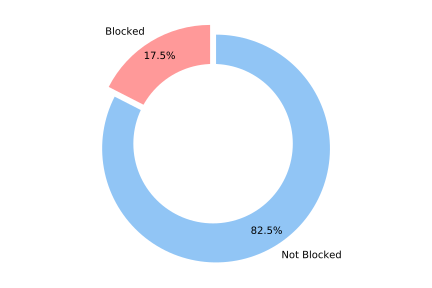

It results from this observation that ad-blockers will perform better on
average if they can efficiently decide which requests to *not block*.

The filters used to determine whether or not
a requests is to be blocked are the ones from
[Easylist](https://easylist-downloads.adblockplus.org/easylist.txt),
where we removed all the cosmetic rules before running the benchmarks.
The final list contains 38978 network filters.

### 1. On All Requests

We first look at all of the requests (whether they will eventually
be blocked or not). We use a log-scale for the x-axis (time in
milliseconds) to facilitate the comparison of the cumulative
distribution of the time it takes for ad-blockers to decide whether or
not a request should be blocked.

Here is a break-down of the 99th percentile and median times for each
ad-blocker:

|               | 99% OF REQUESTS              | MEDIAN                           |
| ------------- | :--------------------------- | -------------------------------- |
| Cliqz         | 0.024ms                      | 0.005678ms                       |
| uBlock Origin | 0.055ms (**2.3x slower**)    | 0.007677ms (**1.35 x slower**)   |
| Brave         | 0.809ms (**34.2x slower**)   | 0.031637ms (**5.57x slower**)    |
| DuckDuckGo    | 12.225ms (**517.7x slower**) | 6.512474ms (**1146.97x slower**) |

Below you can find the cumulative distribution plots of these timings:

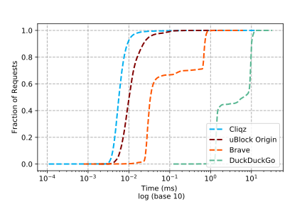

### 2.  Time to Evaluate Requests Which Are Not Blocked

The following table details 99th percentile and median timings for requests not
blocked:

|               | 99% OF REQUESTS              | MEDIAN                          |
| ------------- | ---------------------------- | ------------------------------- |
| Cliqz         | 0.024ms                      | 0.005716ms                      |
| uBlock Origin | 0.049ms (**2.1x slower**)    | 0.007732ms (**1.35 x slower**)  |
| Brave         | 0.817ms (**34.2x slower**)   | 0.030698ms (**5.37x slower**)   |
| DuckDuckGo    | 11.174ms (**468.3x slower**) | 1.599844ms (**279.89x slower**) |

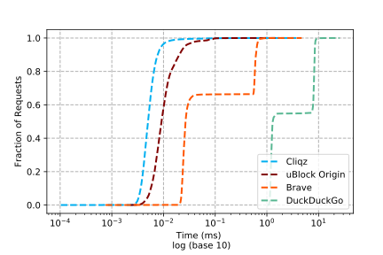

### 3.  Time to evaluate requests that are blocked

The following table details 99th percentile and median timings for requests blocked:

|               | 99% OF REQUESTS              | MEDIAN                           |
| ------------- | ---------------------------- | -------------------------------- |
| Cliqz         | 0.022ms                      | 0.005544ms                       |
| uBlock Origin | 0.072ms (**3.2x slower**)    | 0.007400ms (**1.33 x slower**)   |
| Brave         | 0.648ms (**29.0x slower**)   | 0.035263ms (**6.36x slower**)    |
| DuckDuckGo    | 12.545ms (**561.9x slower**) | 8.835642ms (**1593.73x slower**) |

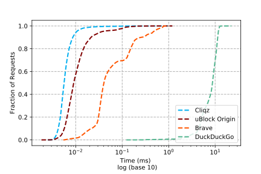

### 4. Serialization and Deserialization

In this section we have a look at the performance of ad-blockers when it comes
to serialize their internal representation for faster sub-sequent loading. Only
DuckDuckGo's engine does not provide this feature.

Serialization time:

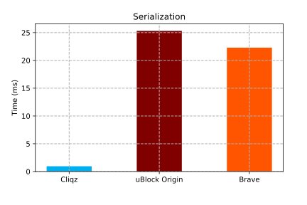

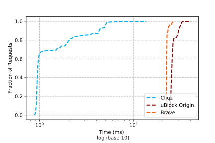

Deserialization time:

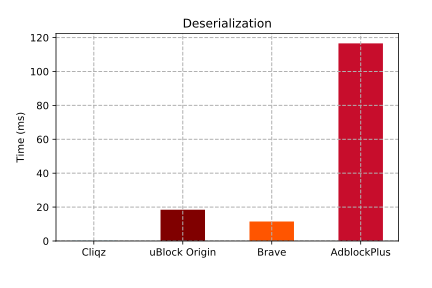

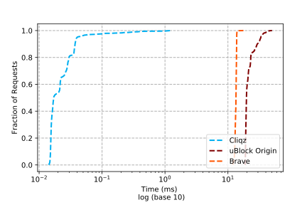

Size of the serialized engines:

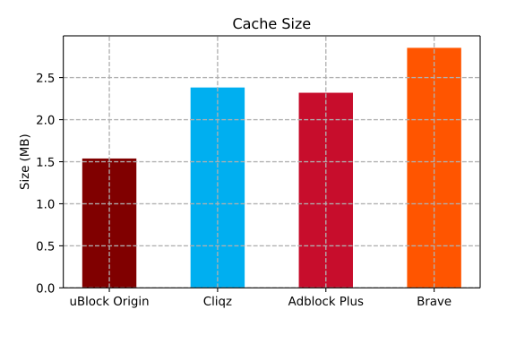

### 5. Memory Consumption at Start-up

Here we consider the memory usage of each blocker after
initialization from lists (not from cache). The measurements were
performed using Chrome's devtools Memory snapshot.

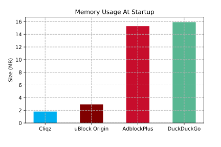

### 6. Parsing Lists

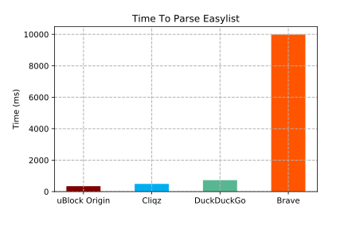
