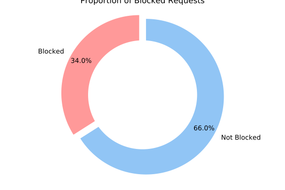

**DISCLAIMER**: This is still work in progress and will be changing as the
analysis is refined.

### **Adblockers: Performance overview**

These are the results of the benchmarks comparing some of the
most popular content-blocker engines (Cliqz, Brave, uBlockOrigin,
DuckDuckGo). We show that Cliqz consistently performs very well.

This comparison does not involve full extensions, but instead **focuses
on the network request blocking engines** (in particular, this does
account for cosmetics engine, etc.). Here are the home pages for all
content-blockers compared:

* Cliqz' adblocker: https://github.com/cliqz-oss/adblocker
* Brave's adblocker: https://github.com/brave/ad-block
* DuckDuckGo's adblocker: https://github.com/duckduckgo/abp-filter-parser
* uBlock Origin: https://github.com/gorhill/uBlock

All blockers except uBlock Origin are available as JavaScript libraries
which can be loaded in Node.js. To allow comparing uBlock Origin as
well, we had to extract the static network filtering engine [out of the
extension](./ublock.js).

All benchmarks were ran on an X1 Carbon 2016 (i7 U6600 + 16 GB) in
Node.js 11.9.0.

### Results

Before presenting the detailed analysis of the results, here we present
our findings in a nutshell:

- **Loading the Cliqz' blocker**
  - 1153x faster than uBlock Origin
  - 786x faster than Brave's Adblocker
  - DuckDuckGo's adblocker does not load from cache, so it's always parsing lists, which makes it 42000x slower.
- **Matching Performance** (median):
  - 1.35x faster than uBlock Origin
  - 5.57x faster than Brave's Adblocker
  - 1147x faster than DuckDuckGo's adblocker
- **Memory Consumption** (startup in Chrome):
  - 1.6x less memory than uBlock Origin
  - 8.8x less memory than DuckDuckGo's adblocker

### 0. About the Dataset

This [requests dataset](https://cdn.cliqz.com/adblocking/requests_200k.json.gz)
was created using Chrome headless browsers to visit home pages of the
*top 50k domains* (as reported by Cliqz Search), as well as up to 3
random pages of each domain (picked randomly from the home page) and
collecting all the network requests seen (URL, document URL and type).

Out of these requests, we kept the first *200k requests*, which accounts
for the 568 most popular domains, and 2503 different pages in total.

### 1. Composition of Requests

For the purpose of this comparison, we consider that each network
request can be either blocked or allowed by the ad-blocker. We observed
that from our dataset of 200k requests, only ~17% are blocked (average
across all ad-blockers).

It results from this observation that ad-blockers will perform better on
average if they can efficiently decide which requests to *not block*.

The filters used to determine whether or not a request is to be blocked
are the ones from [Easylist](https://easylist-downloads.adblockplus.org/easylist.txt),
where we removed all the cosmetic rules before running the benchmarks.
The final list contains 38978 network filters.

### 1. On All Requests

We first look at all of the requests (whether they will eventually
be blocked or not). We use a log-scale for the x-axis (time in
milliseconds) to facilitate the comparison of the cumulative
distribution of the time it takes for ad-blockers to decide whether or
not a request should be blocked.

Here is a break-down of the 99th percentile and median times for each
ad-blocker:

|               | 99% OF REQUESTS              | MEDIAN                           |
| ------------- | :--------------------------- | -------------------------------- |
| Cliqz         | 0.024ms                      | 0.005678ms                       |
| uBlock Origin | 0.055ms (**2.3x slower**)    | 0.007677ms (**1.35 x slower**)   |
| Brave         | 0.809ms (**34.2x slower**)   | 0.031637ms (**5.57x slower**)    |
| DuckDuckGo    | 12.225ms (**517.7x slower**) | 6.512474ms (**1146.97x slower**) |

Below you can find the cumulative distribution plots of these timings:

### 2.  Time to Evaluate Requests Which Are Not Blocked

The following table details 99th percentile and median timings for requests not
blocked:

|               | 99% OF REQUESTS              | MEDIAN                          |
| ------------- | ---------------------------- | ------------------------------- |
| Cliqz         | 0.024ms                      | 0.005716ms                      |
| uBlock Origin | 0.049ms (**2.1x slower**)    | 0.007732ms (**1.35 x slower**)  |
| Brave         | 0.817ms (**34.2x slower**)   | 0.030698ms (**5.37x slower**)   |
| DuckDuckGo    | 11.174ms (**468.3x slower**) | 1.599844ms (**279.89x slower**) |

### 3.  Time to evaluate requests that are blocked

The following table details 99th percentile and median timings for requests blocked:

|               | 99% OF REQUESTS              | MEDIAN                           |
| ------------- | ---------------------------- | -------------------------------- |
| Cliqz         | 0.022ms                      | 0.005544ms                       |
| uBlock Origin | 0.072ms (**3.2x slower**)    | 0.007400ms (**1.33 x slower**)   |
| Brave         | 0.648ms (**29.0x slower**)   | 0.035263ms (**6.36x slower**)    |
| DuckDuckGo    | 12.545ms (**561.9x slower**) | 8.835642ms (**1593.73x slower**) |

### 4. Serialization and Deserialization

In this section we have a look at the performance of content-blockers
when it comes to serialize their internal representation for faster
sub-sequent loading. Only DuckDuckGo's engine does not provide this
feature. uBlock Origin, Cliqz and Brave all offer the possibility
to serialize or cache (uBlock Origin calls them selfies) the entire
blocking engine to either a string or a buffer, which can then be
used to speed-up sub-sequent loads. Another use-case allowed by such
capability is to perform the parsing of the lists on the backend and
ship the serialized form of the content blocker to clients directly,
which allows to remove the cost of initialization completely.

We performed 1000 serializations for each content blocker and display the
results below:

This bar plot contains the median time taken to serialize the engine for each
content blocker:

Similarly, we measure the time it takes to restore the content blocker from its
serialized form:

And here is the median time:

Last but not least, we measured the size of the serialized buffer for each
content blocker:

From these measurements we see that Cliqz's content blocker offers both
significantly faster serialization and deserialization times as well as
a smaller cache size.

### 5. Memory Consumption at Start-up

Here we consider the memory usage of each content blocker after
initialization from lists (not from cache) after one full garbage
collection. The measurements were performed using Chrome's devtools
Memory snapshot. We did not measure Brave here since the memory used
from C++ side does not seem to be taken into account by the devtools.
Also keep in mind that this memory usage can vary at run-time as content
blockers might cache frequently used resources, etc.

### 6. Parsing Lists

In this graph, we present the time it takes for each adblocker to be initialized
from the lists (without any prior caching). We see that only Brave seems to be
significantly slower and that both uBlock Origin, Cliqz and DuckDuckGo perform
well.

Now if we remove Brave, we see that there are still differences between uBlock
Origin, Cliqz and DuckDuckGo. One reason Cliqz is slower than uBlock Origin here
is that to achieve maximum performance while matching as well as minimize size,
there is a bit more work to do up-front. In practice this does not matter so
much since it is a one-time operation and that sub-sequent loads are performed
from cache, and this is really fast (in fact, we can even perform the parsing
backend-side and just ship the serialized version of the blocker, which removes
this step completely).

