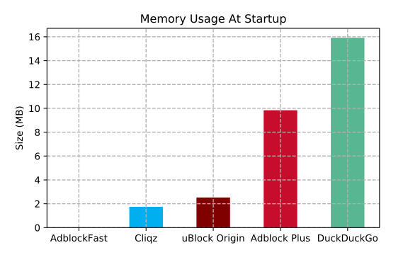
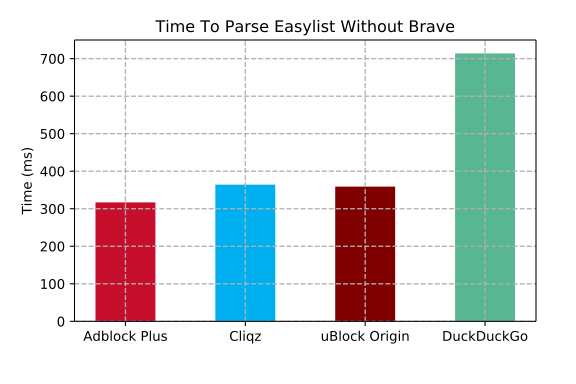

### **Adblockers: Performance Overview**

These are the results of the benchmarks comparing some of the most
popular content-blocker engines (Ghostery, uBlock Origin, Adblock Plus,
Brave, DuckDuckGo).

This study was motivated by the recent [Manifest V3 controversy](https://bugs.chromium.org/p/chromium/issues/detail?id=896897).
One of the proposed changes involves crippling the WebRequest APIs to
limit their blocking abilities. Two justifications were put forth:
*performance* and privacy. We show that the performance of the most
popular content blockers is very good (having a median decision time per
request below 1 milli-second) and should not result in any over-head
noticeable by the users.

This comparison does not involve full extensions, but instead **focuses
on the network request blocking engines**, which is the most CPU
intensive task performed by content blockers (in particular, this does
not account for cosmetics engine, etc.). Here are the home pages for all
content-blockers compared:

* Ghostery and Cliqz's adblocker: https://github.com/cliqz-oss/adblocker
* Brave's adblocker: https://github.com/brave/ad-block
* DuckDuckGo's adblocker: https://github.com/duckduckgo/abp-filter-parser
* uBlock Origin: https://github.com/gorhill/uBlock

We did not include native blockers from Chromium and Safari projects
as this would require some significant effort to package them in a way
that allows benchmarking against the other libraries. We leave this for
future work.

All blockers except uBlock Origin are available as JavaScript libraries
which can be loaded in Node.js. To allow comparing uBlock Origin as
well, we had to extract the static network filtering engine [out of
the extension](./ublock.js). The version of uBlock Origin running in
this benchmark *does not make use of the Webassembly* version of domain
matching.

All benchmarks were ran on an X1 Carbon 2016 (i7 U6600 + 16 GB) in
Node.js 11.9.0.

### Results

Before presenting the detailed analysis of the results, let us highlight
our findings in a nutshell:

- **Matching Performance** (median):
  - 2.4x faster than uBlock Origin
  - 3.0x faster than Adblock Plus
  - 5.6x faster than Brave's Adblocker
  - 1068.9x faster than DuckDuckGo's adblocker
- **Loading Ghostery's blocking engine**
  - 651x faster than uBlock Origin
  - 375x faster than Brave's Adblocker
  - 3754x faster than Adblock Plus
  - DuckDuckGo's adblocker does not offer serialization, so the loading cost is always the one from parsing the lists.
- **Memory Consumption** (at startup, in Chrome):
  - 1.6x less memory than uBlock Origin
  - 8.4x less memory than Adblock Plus
  - 8.8x less memory than DuckDuckGo's adblocker
  - The memory usage of Brave could not be evaluated using the devtools
    and thus is not included in this section.

### 0. About the Dataset

This requests dataset was created using a Chrome
headless browser (driven by the [`puppeteer` library](https://github.com/GoogleChrome/puppeteer)
to visit home pages of the *top 500 domains* (as reported by Cliqz
Search), as well as up to 3 pages of each domain (picked randomly from
the home page) and collecting all the network requests seen (URL, frame
URL and type).

The dataset is composed of 187406 requests. We released the data publicly at
this URL: [requests_top500.json.gz](https://cdn.cliqz.com/adblocking/requests_top500.json.gz)

### 1. Composition of Requests

For the purpose of this comparison, we consider that each network
request can be either blocked or allowed by the content-blocker. We
observed that from our dataset of ~187k requests, only 13.8% are blocked
(average across all ad-blockers).

It results from this observation that content-blockers will perform better on
average if they can efficiently decide which requests to *not block*.

The filters used to determine whether or not a request is to be blocked
are the ones from [Easylist](https://easylist-downloads.adblockplus.org/easylist.txt),
where we removed all the cosmetic rules before running the benchmarks.
The final list contains *38978 network filters*.

It should be noted at this point that a bigger proportion of requests
would be blocked by enabled extra filters lists such as *EasyPrivacy*.

### 1. On All Requests

We first look at all of the requests (whether they will eventually
be blocked or not). We use a log-scale for the x-axis (time in
milliseconds) to facilitate the comparison of the cumulative
distribution of the time it takes for content-blockers to decide whether
or not a request should be blocked.

Here is a break-down of the 99th percentile and median times for each
ad-blocker:

|               | 99% OF REQUESTS                 | MEDIAN                          |
| ------------- | :------------------------------ | ------------------------------- |
| **Ghostery**  |  **0.056015ms**                 | **0.008381ms**                  |
| uBlock Origin |  0.130038ms (**2.3x slower**)   | 0.020108ms (**2.4x slower**)    |
| Adblock Plus  |  0.120776ms (**2.2x slower**)   | 0.025350ms (**3.0x slower**)    |
| Brave         |  1.237248ms (**22.1x slower**)  | 0.046869ms (**5.6x slower**)    |
| DuckDuckGo    | 12.657208ms (**226.7x slower**) | 8.958578ms (**1068.9x slower**) |

Below you can find the cumulative distribution plots of these timings:

### 2. Time To Evaluate Requests Which Are Not Blocked

The following table details 99th percentile and median timings for requests not
blocked:

|               | 99% OF REQUESTS                 | MEDIAN                          |
| ------------- | ------------------------------- | ------------------------------- |
| **Ghostery**  | **0.051614ms**                  | **0.008287ms**                  |
| uBlock Origin | 0.113480ms (**2.2x slower**)    | 0.020104ms (**2.4x slower**)    |
| Adblock Plus  | 0.115511ms (**2.2x slower**)    | 0.025888ms (**3.1x slower**)    |
| Brave         | 1.214424ms (**23.5x slower**)   | 0.042171ms (**5.1x slower**)    |
| DuckDuckGo    | 11.788128ms (**228.4x slower**) | 9.690501ms (**1169.4x slower**) |

### 3. Time To Evaluate Requests That Are Blocked

The following table details 99th percentile and median timings for requests blocked:

|               | 99% OF REQUESTS                 | MEDIAN                         |
| ------------- | ------------------------------- | ------------------------------ |
| **Ghostery**  | **0.063683ms**                  | **0.009223ms**                 |
| Adblock Plus  | 0.139742ms (**2.2x slower**)    | 0.020507ms (**2.2x slower**)   |
| uBlock Origin | 0.224135ms (**3.5x slower**)    | 0.020123ms (**2.2x slower**)   |
| Brave         | 1.625108ms (**25.5x slower**)   | 0.114127ms (**12.4x slower**)  |
| DuckDuckGo    | 13.814562ms (**216.9x slower**) | 8.527992ms (**924.6x slower**) |

On these graphs we observe a plateau for *Adblock Plus*, *Brave* and
*Duckduckgo*. This is explained by the fact that these engines implement
some form of caching internally, thus having a very fast response
time for some requests which were already seen. This caching can be
implemented on top of any content blocker and does not tell much about
the efficiency of each; we can see this as a mean to trade *memory*
against *CPU usage*.

### 4. Serialization And Deserialization

In this section we have a look at the performance of content-blockers
when it comes to serializing their internal representation for faster
sub-sequent loading. Only DuckDuckGo's engine does not provide this
feature. uBlock Origin, Ghostery and Brave all offer the possibility
to serialize or cache (uBlock Origin calls them *selfies*) the entire
blocking engine to either a string or a buffer, which can then be
used to speed-up sub-sequent loads.

Because this is a one-time operation, having a higher loading-time does not
impact significantly desktop users. On the other hand, the ability to quickly
initialize the content-blocker is critical on mobile.

Another use-case allowed by such capability is to perform the parsing
of the lists on the backend and ship the serialized form of the
content-blocker to clients directly, which allows to remove the cost of
initialization completely.

We performed 100 serializations for each content-blocker and display the
results below:

This bar plot contains the median time taken to serialize the engine for each
content blocker:

Similarly, we measure the time it takes to restore the content blocker from its
serialized form:

And here is the median time:

Last but not least, we measured the size of the serialized buffer for each
content blocker:

From these measurements we see that Ghostery offers both significantly
faster serialization and deserialization times as well as a smaller
cache size.

The gist of it is that the internal representation is already mostly
stored in a compact form (using Typed Arrays); this means that
serialization only consists in adding a small amount of metadata
along-side the already available arrays and deserialization is
*essentially instantaneous* since it's enough to create some typed array
views on top of the serialized buffer (think of `mmap` but using Typed
Arrays). This also explains the very low memory consumption: after
initialization, the memory usage is only slightly higher than the size
of the serialized form.

### 5. Memory Consumption at Start-up

Here we consider the memory usage of each content-blocker after
initialization from lists (not from cache) after one full garbage
collection. The measurements were performed using Chrome's devtools
Memory snapshot. We did not measure Brave here since the memory used
from C++ side does not seem to be taken into account in the snapshot.
Also keep in mind that this memory usage can vary at run-time as
content-blockers might cache frequently used resources, etc.

As mentioned in the previous section on serialization, the very low
memory usage of Ghostery can be explained by the fact that the internal
representation mostly consists in very compact typed arrays with some
small over-head for extra meta-data.

### 6. Parsing Lists

In this graph, we present the time it takes for each content-blocker to
be initialized from the lists (without any prior caching, which means
initializing all internal resources by parsing the patterns). We see
that only Brave seems to be significantly slower and that uBlock
Origin, Ghostery, Adblock Plus and DuckDuckGo all perform well.

It seems that the long parsing time for Brave is a [known
issue](https://github.com/brave/ad-block/issues/158) tracked on their
GitHub repository.

Now if we remove Brave, we see that there are still differences between
uBlock Origin, Ghostery, Adblock Plus and DuckDuckGo. One reason
Ghostery is slower than uBlock Origin and AdblockPlus here is that to
achieve maximum performance while matching as well as minimize memory
usage, there is a bit more work to do up-front. In practice this does
not matter so much since it is a one-time operation and that sub-sequent
loads are performed from cache, and this is really fast (in fact, we
can even perform the parsing backend-side and just ship the serialized
version of the blocker, which removes this step completely).

### 7. Conclusion

TODO
